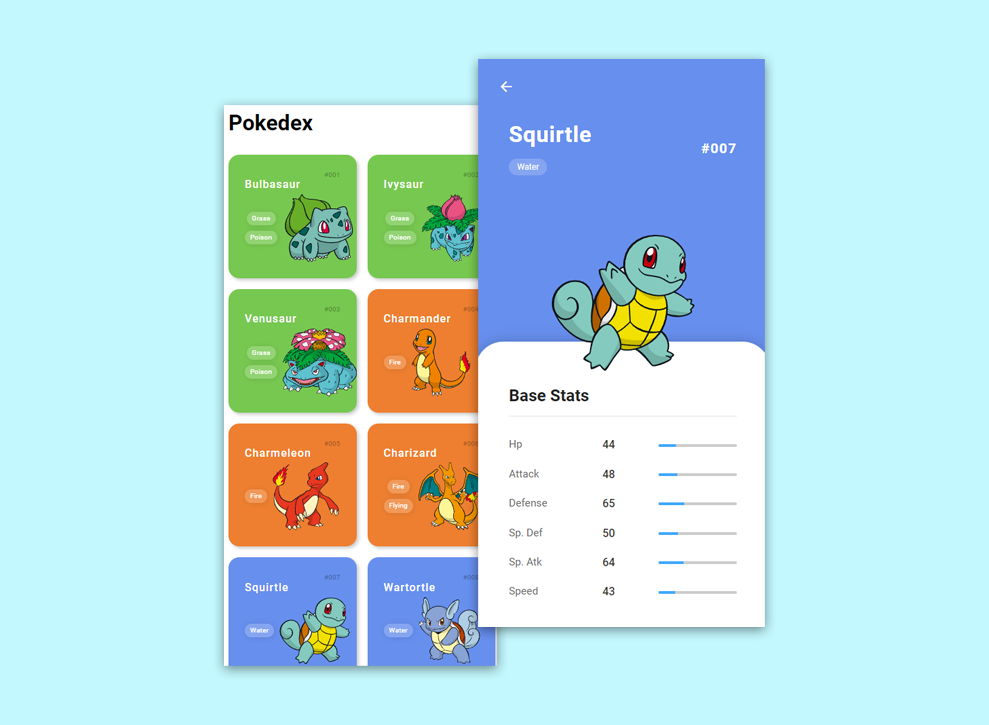

#  **Responsive Pokedex**

 

## 	&#127919; **About**
Uma Pokedex feita parcialmente nas aulas do bootcamp **orangetech**(promovido pelo banco inter) com parceria com a **DIO( Digital Innovation One )** utilizando a PokeAPI. 

 

## 📋**My Experience**
Foi um baita aprendizado para mim, ja tinha feito uma pokedex antes, porem utilizando o **React + Axios**, agora tive que construir a pokedex do 0 utilizando apenas **HTML, CSS e Javascript Puro**.

## 🔧 **Techs**

* HTML
* CSS
* JavaScript

## &#127775; **Features**
&#10004; Mobile Fist &#10004; 100% Responsivo &#10004; Modal dinamico e informativo para cada pokemon

